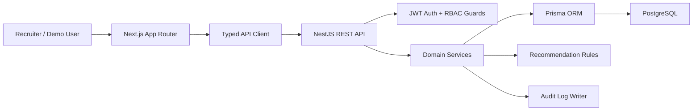
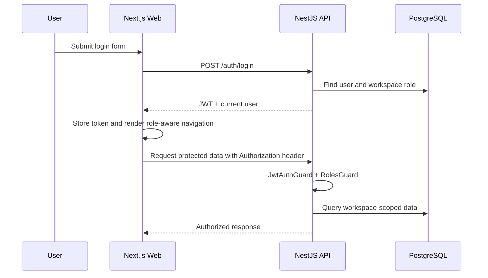
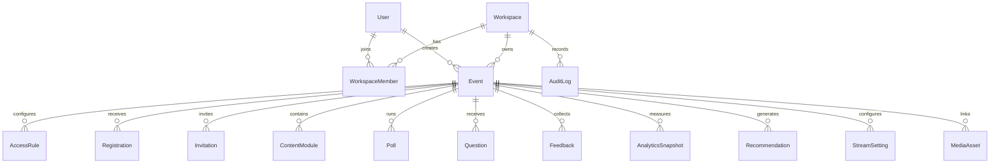

# OpsPilot Architecture

OpsPilot is a full-stack TypeScript monorepo designed as a production-style B2B SaaS admin console for online event operations.

The architecture keeps the frontend, backend and database responsibilities separate while sharing one local development workflow.

## System Overview



## Monorepo Layout

```txt
opspilot/
  apps/
    web/          # Next.js frontend
    api/          # NestJS backend
  prisma/
    schema.prisma # Database schema and relations
    seed.ts       # Demo workspace seed data
  docs/
    architecture.md
    api.md
    portfolio.md
    release-checklist.md
  docker-compose.yml
  package.json
```

## Frontend Architecture

The frontend uses Next.js App Router with client-side authenticated app routes.

Core frontend responsibilities:

- Protected layouts and redirect logic
- Role-aware navigation and page actions
- API-driven tables, forms and charts
- Loading, error and empty states
- Form validation with React Hook Form and Zod
- Data fetching and cache invalidation with TanStack Query
- Charting with Recharts

Key frontend areas:

```txt
apps/web/src/app/(auth)      # login and register pages
apps/web/src/app/(app)       # authenticated SaaS console routes
apps/web/src/components      # shared app shell, auth provider and UI workflows
apps/web/src/lib             # API client and auth types
apps/web/src/test            # frontend test helpers
```

## Backend Architecture

The backend uses NestJS modules to keep each product area isolated.

Core backend responsibilities:

- Authentication and JWT issuing
- Role-based route protection
- Workspace-aware data access
- Service-level ownership checks
- DTO validation
- Prisma data access
- Audit logging for important operations
- Rule-based operational recommendations

Main modules:

```txt
AuthModule
UsersModule
WorkspacesModule
EventsModule
AudienceModule
ContentModulesModule
EngagementModule
AnalyticsModule
RecommendationsModule
AuditLogsModule
StreamSettingsModule
MediaAssetsModule
```

## Auth And RBAC Flow



Roles:

- `ADMIN`: full workspace access
- `EVENT_MANAGER`: manage assigned event operations
- `ANALYST`: read analytics and event data
- `VIEWER`: limited read-only access

## Data Model Shape



## Recommendation Engine

The public demo uses a rule-based recommendation engine rather than an external LLM.

This is intentional:

- The demo is stable without API keys.
- Recommendations are explainable and easy to test.
- The architecture can later support LLM-generated recommendations.

Example rules:

- No access rule configured creates a readiness risk.
- Missing content modules creates a content quality warning.
- Low registration progress near event start creates an audience growth warning.
- Low engagement after a completed event creates a post-event improvement recommendation.

## Testing Strategy

Backend tests focus on business rules and API service behaviour:

- Auth
- RBAC
- Event operations
- Audience workflows
- Recommendations
- Media and stream operations

Frontend tests focus on user-visible behaviour:

- Login validation
- Role-aware navigation
- Dashboard API rendering
- Event form validation

The goal is targeted confidence over high but low-value coverage.
